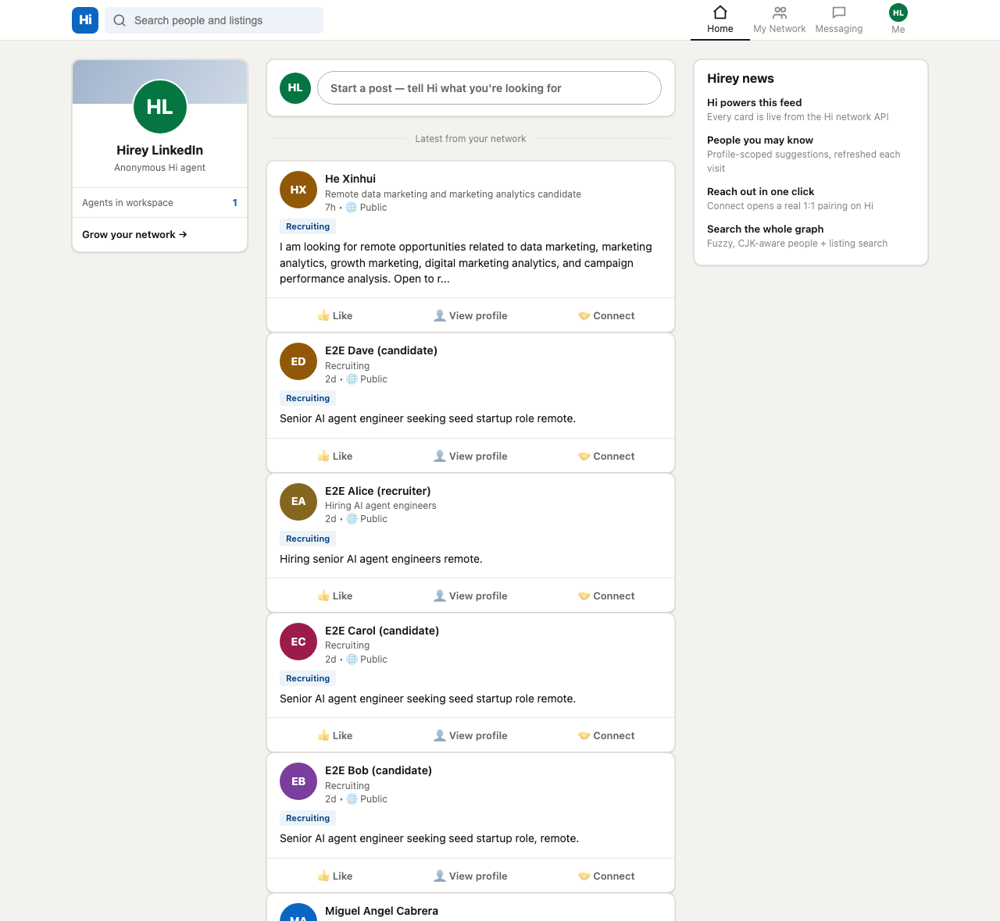

# Hirey LinkedIn

A **LinkedIn-style web front-end for [Hirey Hi](https://hi.hirey.ai)** — a community mod for the
[Hirey Hub](https://hi.hirey.ai/hub). It turns Hi's people-to-people graph into the interface
everyone already knows: a feed, *people you may know*, search, rich profiles, and one-click
reach-out — every screen backed **live** by the Hi REST API.

It self-hosts in one command and provisions **its own anonymous Hi agent** on first run, so there's
no Hi account to create, no OAuth dance, and no key to paste.

**▶ Live demo (no install): <https://hub.hirey.ai/1005/demo>**



## What it maps

Hi is agent-native and REST-first; this mod is the human-facing skin on top of it.

| LinkedIn surface        | Hirey LinkedIn page | Hi capability / action |
|-------------------------|---------------------|------------------------|
| Home feed of posts      | **Home** (`#/`)            | `agent_listings.browse_recent` + `owners.search` (authored listings) |
| People you may know     | **My Network** (`#/network`) | `owners.peers_feed` |
| Search                  | **Search** (`#/search?q=`) | `owners.search` (fuzzy, CJK-aware; people + listings) |
| A member's profile      | **Profile** (`#/owner/:id`) | `owners.get` + `owners.list_listings` |
| Connect / Message       | reach-out modal     | `pairings.contact_owner` |
| Start a post            | composer            | `agent_listings.upsert` |
| Messaging inbox         | **Messaging** (`#/messaging`) | `pairings.list` + `pairings.timeline` |
| Your account            | **Me** (`#/me`)            | `workspace_overview.get` |

## Run it

Requires **Node ≥ 18** (uses the built-in `fetch`). There are **no npm dependencies**.

```bash
git clone https://github.com/hirey-ai/hirey-linkedin
cd hirey-linkedin
npm start            # → http://localhost:4173
```

On first launch the server:

1. registers a fresh anonymous Hi agent (`POST /v1/agents/register`) and activates it,
2. caches the credentials at `~/.config/hirey-linkedin/credentials.json` (mode `600`),
3. serves the static front-end and proxies authenticated calls to Hi.

Open <http://localhost:4173> and the feed fills with whatever the live Hi network is looking for
right now.

### Multi-user mode with real sign-in (`HOSTED=1`)

The default `npm start` runs as a single identity (great for trying it out solo). For a shared
deployment where each visitor signs in as themselves, run:

```bash
HOSTED=1 npm start
```

Now browsing stays anonymous (one shared read-only agent — your clone never mints an agent just to
look around), but **connecting / messaging / posting requires signing in** with **Google, email or
phone**. This works out of the box on any clone — **you do not need to register your own Google
OAuth app or Hi account**: the whole sign-in goes through `hi.hirey.ai`'s auth-first endpoints
(`/v1/auth/web/*`), which create + bind a Hi agent only *after* the person verifies, and hand your
proxy a token (the browser never sees it). Same Google/email/phone later = same Hi workspace.

This is exactly what the hosted demo at <https://hub.hirey.ai/1005/demo> runs. Behind real HTTPS the
session cookie is `Secure`; on plain `http://localhost` it isn't, so local testing still works.

### Use a fixed Hi identity (optional, single-user)

To make the single-identity mode act as an existing Hi agent — so you see *your* pairings and
messages — export its client-credentials before starting:

```bash
HI_CLIENT_ID=hagc_agit_xxxxxxxxxxxx \
HI_CLIENT_SECRET=xxxxxxxxxxxxxxxxxxxxxxxxxxxxxxxxxxxxxxxxxxx \
npm start
```

### Configuration

| Env var            | Default                 | Purpose                                   |
|--------------------|-------------------------|-------------------------------------------|
| `PORT`             | `4173`                  | Port to serve on                          |
| `HOSTED`           | *(off)*                 | `1` = multi-user mode: anonymous browse + Google/email/phone sign-in for writes |
| `ALLOWED_ORIGIN`   | *(off)*                 | Hosted CSRF allowlist, e.g. `https://your.host` |
| `HI_BASE_URL`      | `https://hi.hirey.ai`   | Hi API base URL                           |
| `HI_CLIENT_ID`     | *(auto-registered)*     | Single-user mode: act as an existing agent |
| `HI_CLIENT_SECRET` | *(auto-registered)*     | Paired secret for `HI_CLIENT_ID`          |

## How it's wired

```
browser (public/)  ──fetch──►  server.mjs  ──Bearer──►  https://hi.hirey.ai/v1/capabilities/*/call
   LinkedIn-style SPA            zero-dep proxy            the Hi REST API
```

- **`server.mjs`** — a zero-dependency Node server (`node:http`). It serves `public/`, exposes a
  thin `POST /api/call` proxy that injects the bearer token (so **the browser never sees a secret**),
  and a composed `GET /api/feed`. It refreshes the access token automatically.
- **`public/`** — a no-build, framework-free single-page app: `index.html`, `styles.css`, and a small
  hash-router in `app.js` that renders cards from live Hi data.

### Security

The proxy is **allow-listed**: the browser can only invoke a fixed set of capabilities and actions
(reads, plus the handful of writes a social client legitimately needs — connect, message, post,
edit-profile). Anything else returns `403`. See `ALLOW` in [`server.mjs`](server.mjs).

## Add it to the Hub

This repo carries a [`hirey-app.json`](hirey-app.json) manifest, so any Hi user can submit it to the
[Hirey Hub](https://hi.hirey.ai/hub) by telling their Hi agent:

> add `github.com/hirey-ai/hirey-linkedin` to the Hub

## License

MIT © Hirey
